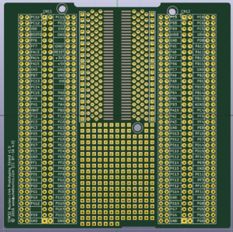

# STM32 Nucleo-144 Prototyping Shield

Note: ~~I don't actually have a Nucleo-144 board at the moment and
haven't had this design manufactured yet.~~ I haven't had time to check how the boards I had made turned out.

This is a prototyping shield for ST's [Nucleo-144][stm32nucleo] development boards. It has the following features:

* Labeled breakout pins for the Morpho connectors. Differences between
  the various Nucleo boards are documented in [ST's User Manual][UM1974]
* 1.27mm pitch (SOIC) SMD prototyping area with two through-hole pads
  per SMD pad
* Through-hole prototyping area
* Four separate columns (2x9-pin and 2x10-pin) of uncommitted
  continuous pads that can be used for power rails and such.

[stm32nucleo]: http://www.st.com/web/catalog/tools/FM116/SC959/SS1532/LN1847?sc=stm32nucleo 
[UM1974]: http://www.st.com/st-web-ui/static/active/en/resource/technical/document/user_manual/DM00244518.pdf
